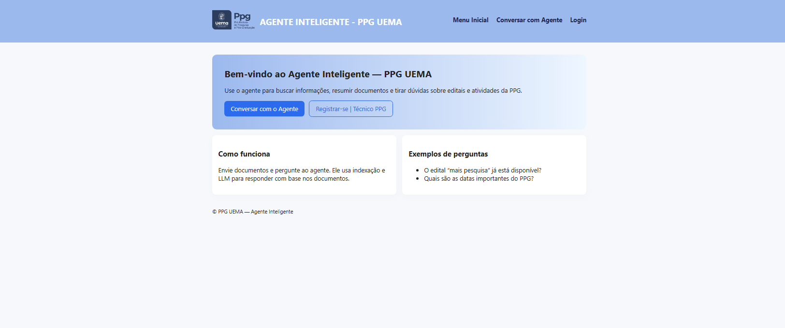
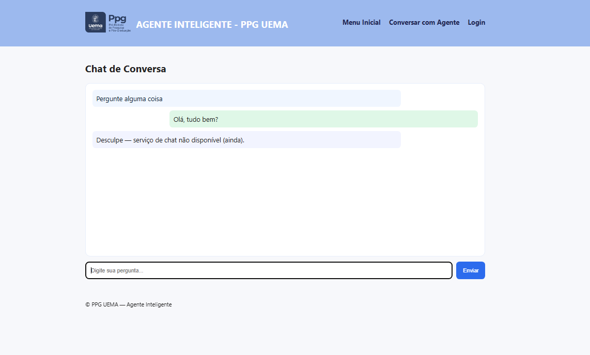

# 🤖 Agente Inteligente – PPG UEMA

Sistema web inteligente desenvolvido para auxiliar o Programa de Pós-Graduação da UEMA (PPG/UEMA) na **consulta, análise e compreensão de documentos acadêmicos**, como editais, regulamentos e documentos institucionais, utilizando **Processamento de Linguagem Natural (PLN)** e **Inteligência Artificial**.

---

## 📌 Visão Geral do Projeto

O **Agente Inteligente – PPG UEMA** permite que usuários realizem perguntas em linguagem natural sobre documentos em PDF previamente enviados ao sistema.  
O agente extrai o texto dos documentos, constrói um contexto relevante e utiliza um **modelo de linguagem via Groq Cloud** para gerar respostas claras, objetivas e baseadas exclusivamente no conteúdo dos documentos.

---

## 🖥️ Visão das Principais Telas

- Página Inicial



- Página de conversa com Agente Inteligente



---

## 🎯 Objetivos

### Objetivo Geral
Desenvolver um agente inteligente capaz de apoiar usuários do PPG/UEMA na consulta e interpretação de documentos acadêmicos de forma automatizada.

### Objetivos Específicos
- Permitir upload e gerenciamento de documentos PDF
- Extrair texto automaticamente dos documentos
- Fragmentar (chunking) textos extensos para melhor análise
- Construir contexto relevante para perguntas dos usuários
- Gerar respostas utilizando modelos de linguagem (LLMs)
- Garantir controle de acesso por tipo de usuário
- Disponibilizar uma interface web simples e intuitiva

---

## 🧠 Funcionalidades Principais

- Autenticação de usuários (Login e Registro)
- Upload de documentos PDF
- Extração automática de texto
- Construção de contexto a partir de múltiplos documentos
- Chat interativo com o agente inteligente
- Respostas baseadas **somente** nos documentos enviados
- Integração com a **Groq Cloud API**
- Interface web

---

## 🏗️ Arquitetura do Sistema

Usuário → Interface Web → Django (Backend) → Módulo de IA → Resposta ao Usuário

---

## 🛠️ Tecnologias Utilizadas

### Backend
- Python
- Django

### Frontend
- HTML5
- CSS3
- JavaScript

### Inteligência Artificial
- Groq Cloud API
- Modelo: `llama-3.1-8b-instant`

### Banco de Dados
- SQLite

---

## 📂 Estrutura do Projeto

```
├── 📁 assets
│   ├── 🖼️ Página_Inicial_Desenvolvimento.png
│   ├── 🖼️ pagina_conversa.png
│   └── 🖼️ pagina_inicial_prototipo.png
├── 📁 codigoSQL
│   └── 📄 script.sql
├── 📁 core
│   ├── 📁 ia
│   │   ├── 🐍 chunking.py
│   │   ├── 🐍 context_builder.py
│   │   ├── 🐍 generator.py
│   │   ├── 🐍 groq_client.py
│   │   └── 🐍 retriever.py
│   ├── 📁 management
│   │   ├── 📁 commands
│   │   │   ├── 🐍 __init__.py
│   │   │   └── 🐍 create_groups.py
│   │   └── 🐍 __init__.py
│   ├── 📁 migrations
│   │   └── 🐍 __init__.py
│   ├── 📁 templates
│   │   └── 📁 core
│   │       ├── 🌐 base.html
│   │       ├── 🌐 chat.html
│   │       ├── 🌐 document_detail.html
│   │       ├── 🌐 editar_documento.html
│   │       ├── 🌐 excluir_documento.html
│   │       ├── 🌐 home.html
│   │       ├── 🌐 login.html
│   │       ├── 🌐 register.html
│   │       ├── 🌐 resumo.html
│   │       ├── 🌐 search.html
│   │       └── 🌐 upload.html
│   ├── 📁 templatetags
│   ├── 🐍 __init__.py
│   ├── 🐍 admin.py
│   ├── 🐍 apps.py
│   ├── 🐍 forms.py
│   ├── 🐍 models.py
│   ├── 🐍 tests.py
│   ├── 🐍 urls.py
│   ├── 🐍 utils.py
│   └── 🐍 views.py
├── 📁 documentacao
│   └── 📘 Documentação_Projeto_Agente_Inteligente_PPG.docx
├── 📁 repositorio_ppg
│   ├── 🐍 __init__.py
│   ├── 🐍 asgi.py
│   ├── 🐍 settings.py
│   ├── 🐍 urls.py
│   └── 🐍 wsgi.py
├── 📁 static
│   ├── 📁 css
│   │   └── 🎨 style.css
│   ├── 📁 img
│   │   └── 🖼️ ppguema.png
│   └── 📁 js
│       └── 📄 chat.js
├── ⚙️ .env.example
├── ⚙️ .gitignore
├── 📝 README.md
├── 🐍 manage.py
└── 📄 requirements.txt
```

---

## ⚙️ Configuração do Ambiente

1. Criar ambiente virtual  
2. Instalar dependências  
3. Configurar variável de ambiente `GROQ_API_KEY`  
4. Executar o servidor Django

---

## ▶️ Executando o Projeto

```bash
git clone github.com/mateuscd1/Agente_Inteligente

#Criar ambiente virtual
python -m venv venv

# Windows ativar ambiente
venv/Scripts/activate   

#LINUX/MACOS ativar ambiente
source venv/bin/activate

#Instalar dependências
pip install -r requirements.txt

#Configurar variável de ambiente (Groq API)
#Windows (PowerShell)
setx GROQ_API_KEY "SUA_CHAVE_AQUI"

Linux / macOS
export GROQ_API_KEY="SUA_CHAVE_AQUI"


python manage.py migrate
python manage.py runserver
```

---

## 🔐 Segurança

- Chaves de API via variáveis de ambiente
- `.env` e banco local ignorados no Git
- Controle de acesso por perfil

---

## 🚀 Trabalhos Futuros

- Ranking semântico de trechos
- Histórico de conversas
- Dashboard administrativo
- Deploy em produção
- Integração com Banco PostgreSQL
- FrameWork para Fron-End Robusto

---

## 👨‍🎓 Autor

João Mateus Dutra

Curso: Engenharia de Computação – UEMA

Projeto acadêmico desenvolvido para fins educacionais.

## 📄 Licença

Este projeto é de uso acadêmico e educacional